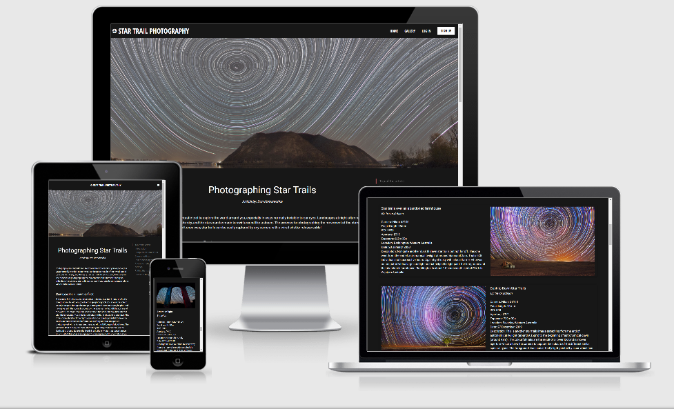
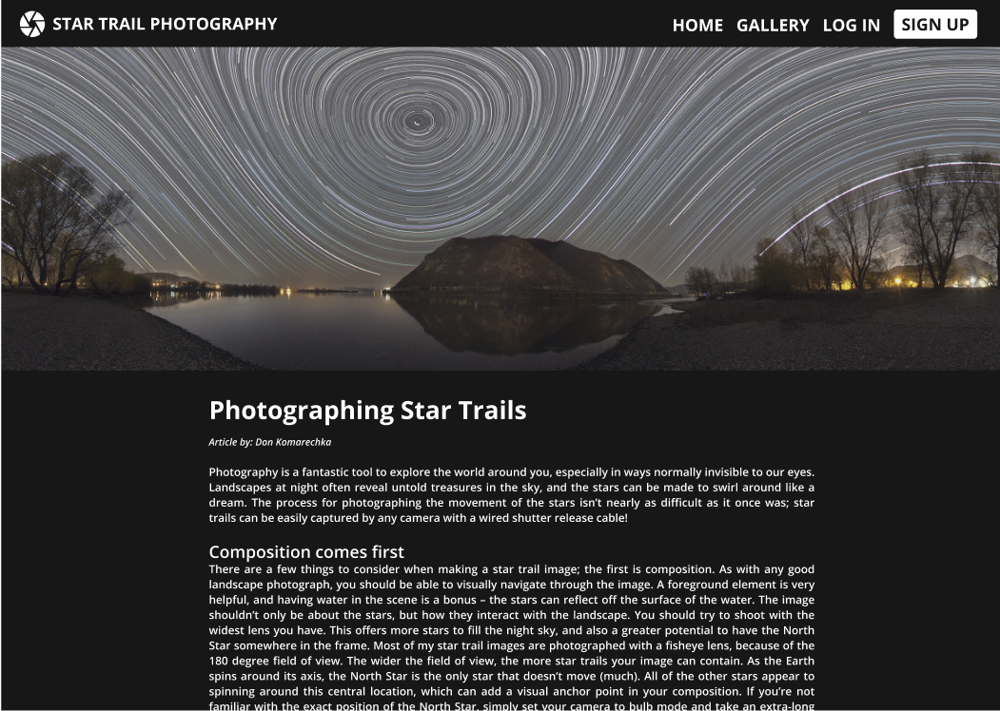
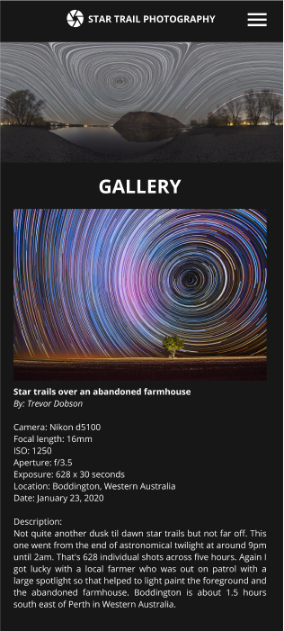

# STAR TRAIL PHOTOGRAPHY
## Milestone project no.3
### Data Centric Development Milestone Project

#### Click [HERE]( http://star-trail-photography.herokuapp.com/) for a link to the live website.
This website was created for educational purposes only.

## INTRODUCTION
Star Trail Photography is a specific type of night photography, with a bit of a technical side to it. The pictures you can take are 'out of this world'! 
How does it work? The earth spins around its axis, but when we look at the sky at night it seems as if the sky is spinning around the polar star. You cannot really see this with the naked eye, but with the right camera and the right settings, you can track the movement of the stars and turn it into a beautiful picture. 
When I first started with star trail photography, I looked up several websites with instructions. The best way I learned however, was to look at other people's pictures and the settings they had used, because it can be tricky to choose your ISO (light sensitivity), aperture (= width of lens opening), shutter speed (= duration of exposure) etc. Therefore, my website will give a new photographer instructions, but also has a gallery with images accompanied by a description and the settings a photographer has chosen. 

The website performs CRUD operations. CRUD stands for create, read, update and delete records. This means that:
- Users have the ability to view and search images in the gallery. 
- Users can create an account and change their password. They can also delete their account.
- When logged in, users have the ability to upload (create) images to the gallery. They can edit or delete their own images. Other users cannot access these images, except for the Administrator. 

This was website was built using HTML, CSS (Materialize), Javascript (jQuery), Python (Flask, Jinja, PyMongo, Werkzeug) and uses MongoDB Atlas as a database. It can be viewed on pc monitors, laptops, tablets and mobile devices. It is hosted on Heroku and can be viewed [here]( http://star-trail-photography.herokuapp.com/).

## Table of contents
- [**UX**](#UX)
    - [Goal/Strategy](#Goal/Strategy)
    - [Scope](#Scope)
    - [Structure](#Structure)
    - [Skeleton](#Skeleton)
    - [Target audiences](#Target-audiences)
    - [User Stories](#User-Stories)
    - [Design](#Design)
        - [Color choices](#Color-choices)
        - [Font families](#Font-families)
        - [Materialize](#Materialize)
    - [Mock-ups](#Mock-ups)
- [**Features**](#Features)
    - [Existing features](#Existing-features)
    - [Features left to implement](#Features-left-to-implement)
- [**Technologies used**](#Technologies-used)
- [**Testing**](https://github.com/mkthewlis/Milestone-Project-3/blob/master/testing.md)
- [**Deployment**](#Deployment)
    - [Clone from GitHub](#Clone-from-github)
    - [Deployment to Heroku](#Deployment-to-Heroku)
- [**Credits**](#Credits)
    - [Media](#Media)
    - [Content](#Content)
    - [Sources](#Sources)
    - [Acknowledgements](#Acknowledgements)

## UX
### Goal/Strategy
The goal of this website is to inform those who are interested, about star trail photography with both text and example images, and also to be a platform where users can share their own images. 

### Scope
An easy to navigate and responsive website that is informative and allows users to perform CRUD operations. Users can sign up and, once logged in, share their own photography. These users manage their own images, meaning they can edit and delete them when they want. Also, they can update their password and even delete their account. All users can view and search images in the gallery.  

### Structure
The website consists of a number of pages. Thanks to templating language Jinja, they all share the same base. This base consists of a navigation bar, a banner image, a section for flash images, a content block and a footer. 
1. Visible for all users:
- The home page, where the content block contains an article about star trail photography. It is accompanied by a 'scrollspy' on the right side, that helps the user jump to relevant sections of the article. The scrollspy is not visible on smaller screens.
- The gallery with images that are uploaded by signed up members of this website. Each image has details (title, the photographer/user, camera, settings, location, date and a description) next to it. There is also a search bar at the top. A user can search the fields title, user and description. Finally, a user can sort images by date taken and date uploaded (both ascending and descending).
2. Visible for guest users:
- A log in page.
- A sign up page. 
3. Visible for logged in users:
- A log out option in the navigation bar.
- A profile page, where a user can click on a button that redirects him to a page where he can then update his password. From here, he can also delete his account. Finally, the profile page shows all the images that were uploaded by the user. 
- In the gallery, a logged in user sees an 'add your image' button, that redirects the user to a form for uploading an image. 
- Also in the gallery, the user sees two buttons under each of his own images. These buttons are also visible on the profile page. The pen button redirects a user to a form where he can edit his image and save the changes (or cancel and go back to the previous page). The bin button makes a modal pop up, asking the user whether he really wants to delete this image. A user can cancel and go back to the page, or he can confirm, which results in the deletion of the image from the database and therefore from the gallery (and of course from his profile).  

### Skeleton
Wireframes were created using Figma. Images of these wireframes are available under 'wireframes'. Responsiveness consists mostly of adapting the size of the content to different sizes of screens. Also, the gallery doesn't juxtapose images and their details, but positions images and text on top of each other. The design is consistent. 

### Target audiences
The website targets those who are interested in star trail photography, for example amateur/beginning photographers, but also more advanced photographers who want to show their work to others as an example.   

### User stories
As the creator of this website...
- I want my website to be attractive so that a user is enticed to navigate it and discover all there is to see. 
- I want my website to have a clear structure, so that it is easy to navigate.
- I want my website to give feedback to users, so that it is easy to navigate.
- I want my website to inform users about how to take star trail photographs.
- I want my website to have users sign up, and share and manage their photography.
- I want let my registered users manage their own work and their account.
- I want to protect the work of users by not giving rights to edit and delete images to others than themselves. They should also be the only ones to be able to change their password or delete their accounts. 
- I want to prevent random guest users to upload random images and information, so as not to pollute the gallery. 
- I want users that upload their work to fill out the form with details. 
- I want to warn users when they try to delete their work, as a form of defensive programming. 
- I want to have rights over all the content on my website, by giving myself the role of administrator, in case users behave in an unwanted fashion (f.e. uploading irrelevant content). 

As a user in general...
- I am interested in star trail photography. 
- I enjoy looking at beautiful images of star trails.
- I want to learn about how to create star trail images myself. 
- I want to search through the gallery.
- I want to sort images in the gallery.
- I want to be able to easily navigate the website. 
- I want to be able to contact the creator of the website. 

As a guest user...
- I want to be able to sign up, so that I can share my own work.

As a logged in user...
- I want to upload my work to the gallery, providing details about my images.
- I want to manage the work that I have uploaded.
- I want to have a profile page where I can see only my work.
- I want to be able to update my password. 
- I want to be able to delete my profile.
- I want to be able to log out.

### Design
#### Color choices
Star trail photography takes place during the night. It made sense to make my website dark as the night. My main goal with this dark background, is to make the banner and images in the gallery POP! It attracts the eye of the user to the beautiful light of the stars. The images are the center of this website. 
This is also why the buttons are fairly dull. Most of them are grey or white with a white or black hover effect, and don't stand out that much. The sign up button attracts more attention because of its white color in the navigation bar. This is intentional, because as the creator of this website, I want my website to become a platform with many users that want to share their work.
The flash messages give feedback to the user about whether his actions have worked and are therefore quite important. At first, the text was just in white, like the rest of the content on the website. But I chose for green and red colors instead (and icons) to make it immediately clear if something has worked or gone wrong. 
In total, 8 colors are used:
-  #171717 Nero
-  #A2A2A0 Mountain Mist
-  #000000 Black
-  #FFFFFF White
-  #B2CB91 Sprout
-  #4E6E43 Fern Green
-  #FF9B9B Rose Bud 
-  #8B0000 Dark Red 

#### Font families
I used the following font-families:
- 'Roboto' (sans-serif) for text in the body.
- 'Open Sans Condensed' (sans-serif) for navigation bar and buttons. 

#### Materialize
I have used Materialize instead of Bootstrap for this website. I thought it would be good for me to explore other options than Bootstrap. Doing this, I have learned a lot. Materialize uses a similar grid but also has a lot of features that are easy to use such as the forms that give feedback to users, the datepicker and the scrollspy. I really like this. I also like the Material Design icons. I am however someone who likes to keep control of things and therefore went with my own colors in my style.css file instead of using color names and effects in my html file. 
The downside of using Materialize instead of Bootstrap was that Materialize doesn't have order-classes. Since the gallery juxtaposes image and text, where uneven images are on the right and even images are on the left, the order for mobile screens (with stacked images and text) turned into 'text - image - image - text' etc. With Bootstrap, this could have been solved with order classes. I further talk about this in the testing file. 

### Mock-ups
Mock-ups for this website were created using Figma.<br>
Creating mock-ups in Figma takes quite a bit of time, because I focus mainly on the frontend. Next time, I would like to use Balsamiq for my wireframes, in order to focus more on the structure of the website and the features that I can build.<br>
My first plan was to create a responsive website about star trail photography with simple CRUD functionality, and with Materialize as a framework. The website would include a homepage with an article and a gallery. The features I was planning to use were functionalities to sign up, log in, log out, add images, edit images and delete images. This is visible in the Figma mock-ups. As I was working on the project, however, I realized that I could do more. By doing more, I was going to learn more. So instead of completing the project in 3 weeks, I decided to spend more time on it and added features such as a scrollspy, sorting and search functionality, a profile page and the options to edit a password and to delete an account were added. 
#### The desktop version of the homepage:

#### The desktop version of the gallery:

#### The mobile version of the gallery:


## FEATURES
### Existing features
- **Sign Up, Change Password and Delete Account functionality** - Signing up is very simple. Only two fields have to be filled in: username and password. The username and password have to meet certain requirements such as a minimum and maximum length and the use of certain characters. Before adding this new account to the database, the signup function checks if the name already exists in the database. If not, a user is registered successfully with a hashed password and logged in. He can change his password at any time. A user can delete his account as well. He is then logged out and redirected to the Sign Up page. The user's account is deleted from the database. 
- **Login and Logout Functionality** - After logging in with the information that was provided when signing up, the user is redirected to his profile page. A user can log out by clicking on Log Out in the navigation bar. The session cookie is then deleted and the user is redirected to the log in page. 
- **Complete CRUD functionality for the gallery** - Users can view and search images in the gallery. Registered users can upload an image with details; this is then displayed in the gallery and on the profile page. Buttons for editing/deleting appear under the images he owns. He can change these images/details through a form that displays the current information. While adding or editing, he can always cancel and be redirected back to the gallery/profile page. Also he can decide to delete an image as a whole, by clicking on the bin button. A modal pops up to warn the user he is about to delete his image. He can then confirm or cancel. 
- **Responsive Materialize navigation bar** - The links in the navigation bar vary, based on whether a user is logged in or not. As a guest user, one sees Home, Gallery, Log In and Sign Up. Once signed up or logged in, Sign Up and Log In disappear. Instead, a user sees Profile and Log Out. 
- **Instructions on star trail photography** - Instructions are present in the form of an article on the homepage. 
- **Materialize scrollspy** - On the right side of the article, users see a scrollspy that can redirect them to relevant paragraphs. The scrollspy is not visible on small screens. 
- **Gallery with images and a search bar** - All users can search the gallery (search covers the fields title, user and description). The gallery is filled with images uploaded by registered users. 
- **Sort images option** - In the gallery, users can sort images in 4 ways: by date uploaded, both ascending and descending, and by date taken, also both ascending and descending. 
- **Profile page** - This shows the user his username, a button for editing his password, a button for deleting his profile and the images that he has uploaded with buttons for deleting and editing the images.
- **Go to top button** - In the gallery and on the profile page, users can go to the top of the page by clicking on a small arrow on the right side of the bottom of the page.
- **Materialize forms** - These forms are used for signing up, logging in, updating a password, adding an image and editing an image. The forms give feedback to the user. It can remind a user that a field is left empty or filled out incorrectly with a message and a red color, based on the requirements in the code. Green means the field has been filled out correctly. The forms also don't let a user use more characters than allowed, typing is disabled in that case. 
- **Materialize datepicker** - In the forms for adding and editing an image, a datepicker appears when a user goes to the date field. A user can only select today and past dates (it goes back ten years). 
- **Flash messages** - Flash messages give feedback to the user about his activity and appear right under the banner image after actions such as signing up, logging in or adding an image. Green flash messages mean the action was successful, red messages mean the action was unsuccessful. Flash messages will stay on the page until a user refreshes it or goes to a different page. 
- In general this website consists of a header, content with images, buttons and icons, and a footer. Users can be redirected to (social) media websites through the footer. The website has a responsive design and was built in GidPod and hosted by Heroku. Documentation is present. 

### Features left to implement
- **Hide and show password** - Currently, the password is hidden both when signing up and logging in. My preference would be to hide the password by default for security reasons, but to allow a user to make the password visible by clicking on an eye icon, to reduce login problems.
- **Confirm password** - A user could make a typing error in the password when creating his account, and then never being able to log in. Having him confirm his password reduces the risk of making a mistake in the password while signing up. 
- **Recover password** - A user would have to sign up with an e-mail address. If he has forgotten his password, this e-mail address could be used to recover the password.
- **Like button** - Following platforms such as Facebook, Instagram or Flickr, a like button could be implemented. Registered users could then like images to show appreciation. I would also permit a user to delete his like. A counter could track the number of likes given to an image. This would also give the opportunity to create a sorting option, based on popularity. 
- **Save button** -  A user could save an image he likes, which would then be shown on his profile under 'favorites'. I had actually started writing code for this option, but had to stop due to the fact that I didn't have enough time. 
- **Comment section** - Users could comment on each other's images, preferably giving compliments or asking questions. I would prefer a moderator to check the posts before they are shown in the comment sections.  
- **Share on social media** - This would allow a user to share an image on his personal social media page. It would give publicity to both my website and the photographers.  
- **Pagination** - To prevent the gallery from becoming a very long page when the number of uploaded images increases, pagination (f.e. 10 images per page) could be used. 
- **Upload images directly from a phone or a computer** - This way a user no longer needs to store his image online and provide a link. 

## TECHNOLOGIES USED
- [HTML](https://developer.mozilla.org/en-US/docs/Web/HTML)
was used for the structure of the website.

- [CSS](https://developer.mozilla.org/en-US/docs/Web/CSS)
was used to add style to the website.

- [Javascript](https://developer.mozilla.org/en-US/docs/Web/Javascript)
was used as an application controller.

- [jQuery](https://jquery.com/)
is a JavaScript library, used as an application controller and to initialize Materialize components.

- [Materialize]( https://materializecss.com/)
was used for making the website responsive. 

- [Python]( https://www.python.org/) 
was used as the backend programming language. 

- [Flask]( https://flask.palletsprojects.com/en/1.1.x/) 
was used as a micro web framework (which is written in Python).

- [Jinja]( https://jinja.palletsprojects.com/en/2.11.x/) 
is the template engine that Flask depends on.

- [PyMongo](https://pypi.org/project/pymongo/)
distribution contains tools for interacting with MongoDB database from Python.

- [Werkzeug]( https://werkzeug.palletsprojects.com/en/1.0.x/) 
is a WSGI web application library.

- [MongoDB Atlas](https://www.mongodb.com/cloud/atlas) 
was used as a database.

- [Git](https://git-scm.com/)
was used for Version Control.

- [GitHub](https://github.com/)
is where the repository is hosted.

- [Heroku]( https://www.heroku.com/)
is where the live website is hosted.

- [Google Chrome](https://www.google.com/chrome/)
was used for the Chrome DevTools and as a browser.

- [Google Fonts](https://fonts.google.com/)
was used to select font-families Roboto and Open Sans Condensed. 

- [Autoprefixer CSS online](https://autoprefixer.github.io/)
was used to prefix my CSS.

- [Font Awesome](https://fontawesome.com/)
was used for different icons.

- [Material Icons](https://material.io/resources/icons/?style=baseline) 
was used for different icons.

- [Figma](https://www.figma.com/)
was used to create wireframes. 

- [Am I Responsive](http://ami.responsivedesign.is/)
was used to test the responsiveness of the website.

## TESTING
The testing process can be found in this separate document [here](
https://github.com/SuzanneNL/star-trail-photography/blob/master/testing.md).

## DEPLOYMENT
### Clone from GitHub:
To run the application locally, you can follow these steps: 
1. Go to the repository [SuzanneNL/ star-trail-photography]( https://github.com/SuzanneNL/star-trail-photography).
2. Click on **code** (next to the green gitpod button).
3. In the dropdown menu, copy the clone link (which is https://github.com/SuzanneNL/star-trail-photography.git).
4. Open your working directory. In the terminal, clone the repository by running the following command:
```
git clone https://github.com/SuzanneNL/star-trail-photography.git
```
5. Install all required modules with the following command:
```
pip3 install -r requirements.txt
```
6. Create a database in MongoDB. Add the first collection, called `users`: 

**Key**|**Data Type**
:-----:|:-----:
_id|ObjectId()
username|string
password|string

7. Add the second collection, called `images`:

**Key**|**Data Type**
:-----:|:-----:
_id|ObjectId()
url|string
image_title|string
camera|string
focal_length|string
iso|string
aperture|string
exposure|string
location|string
date|string
description|string
created_by|string

8. Create the `env.py` file for environment variables, and add the following:
```
import os
os.environ.setdefault("IP", "0.0.0.0")
os.environ.setdefault("PORT", "5000")
os.environ.setdefault("SECRET_KEY", "<your Secret Key>")
os.environ.setdefault("MONGO_URI", "<your Mongo URI>")
os.environ.setdefault("MONGO_DBNAME", "<name of your database>") 
```
Make sure to fill in your own values for the Secret Key, Mongo URI and Database Name.<br>
9. Add your env.py file to `.gitignore`, before pushing your changes.<br>
10. To run the application locally, run the following command:
```
python3 app.py
```

### Deployment to Heroku
Steps to deploy this project are as follows:
1. Create the `requirements.txt` file by running the following command:
```
pip3 freeze --local > requirements.txt
``` 
2. Create the `Procfile` by running the following command:
```
echo web: python app.py > Procfile
```
3. Open the `Procfile` and delete the empty line. Save the file.
4. Add, commit and push these two files to Github.
5. Go to **[Heroku](https://www.heroku.com/)** and log in.
6. At the top right of the page, click on **New**. 
7. From the dropdown menu select **Create New App**.
8. Type a unique **App name** and select your **region**. Then click on **Create app**.
9. In the app, the **Deploy** tab is open. In the section **Deployment Method** click on **Github - Connect to Github**.
10. Make sure your **Github Profile** is displayed. Add the **repository name** and click on **Search**.
11. After Heroku has found the repository, click on **Connect**.
12. At the top of the page, click on the **Settings** tab. Then click on **Reveal Config Vars**.
13. In the section **Config Vars** enter the following values:

 **Key**|**Value**|
:-----:|:-----:
IP|0.0.0.0
PORT|5000
SECRET_KEY|value as written in the env.py file
MONGO_URI|value as written in the env.py file
MONGO_DBNAME|name of your database

14. Go back to the **Deploy** tab and click on **Enable Automatic Deploys**.
15. In the section **Manual deploy**, click on **Deploy Branch**.
16. Building the app will take a few minutes. When successful, you will see a message saying "Your app was successfully deployed".
17. Click on **View** to launch the app.

## CREDITS
### Media
All the images used on this website were taken from flickr accounts. The details such as camera and ISO were copied as well, when they were provided. If not, these details are left empty or guessed. 
- Trevor Dobson:
	- https://flic.kr/p/2iqdNK7
	- https://flic.kr/p/2ifLFh2
	- https://flic.kr/p/2gYNYoW
	- https://flic.kr/p/qFKXCX 
- Jonathan Ang:
	- https://flic.kr/p/2jBBQVW
- RS2Photography
	- https://flic.kr/p/2gb3ggp
- György Soponyai
	- https://flic.kr/p/2aYaQU4
	- https://flic.kr/p/T2fNgA (the banner image)
- gerlos
	- https://flic.kr/p/25s43h2
- achrntatrps
	- https://flic.kr/p/22rib6W
	- https://flic.kr/p/Jv7rRM
- Joel Tonyan
    - https://flic.kr/p/NnqKyo
- Beau Rogers
    - https://flic.kr/p/EMkGDh

### Content
The article on the homepage was for the most part written by Don Komarechka, who gave permission to copy the text. The text was taken from [digital photography school](https://digital-photography-school.com/tips-photographing-star-trails/). 

### Sources 
I learned a lot from CI's Task Manager Application, and I have applied much from what I've learned to develop this website. Apart from that, several sources have helped to resolve issues:
- Size the banner image:
	- https://stackoverflow.com/questions/37194886/does-materialize-css-framework-have-a-container-fluid-equivalent
- Make images in the gallery responsive:
	- https://stackoverflow.com/questions/50652298/how-to-resize-an-image-inside-of-a-materialize-css-slider-to-make-it-fit
- Get the current year for the datepicker, and make sure that the datepicker doesn't show future years in the years' dropdown menu:
	- http://eppand.com/jquery-current-year/
	- https://stackoverflow.com/questions/7934252/jquery-datepicker-with-today-as-maxdate
- Create circles around social media icons:
	- https://stackoverflow.com/questions/21905710/make-font-awesome-icons-in-a-circle
- Get bullet points:
	- https://www.w3schools.com/howto/howto_css_bullet_color.asp
- Show search result numbers, and change password function:
	- https://github.com/gaspar91/FeedMe
- Redirect a user back to the page where he was, after deleting an image:
	- https://stackoverflow.com/questions/28593235/get-referring-url-for-flask-request/28593313#28593313
- Go to top of the page button:
    - https://www.w3schools.com/howto/howto_js_scroll_to_top.asp

### Acknowledgements
I looked up different black websites and chose some color codes and fonts from [Avocode Enterprise](https://avocode.com/enterprise). 

I received advice and encouragement from:
- Family and friends
- Seun Owonikoko
- Code Institute